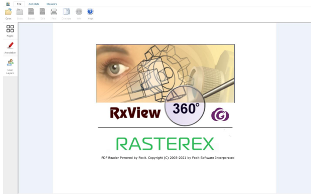

## RxView360 HTML GUI

RxView360 client consists of a single HTML page and acts as an independent complete viewer. You can modify this HTML page to customize the operation. Several functions can be called to operate on the files and markup displayed in the viewer.



### 1.1 Dependencies

RxCorefunctions.js depends on some third-party JavaScript libraries that need to be referenced in the HTML source along with rxcorefunctions.js. These are:
- jQuery: [https://jquery.com](https://jquery.com)
- Three.js: [https://threejs.org/](https://threejs.org)
- Foxit SDK: [https://developers.foxitsoftware.com](https://developers.foxitsoftware.com)

### 1.2 How to add to HTML

Add `rxcorefunctions.min.js` as a JavaScript reference in the header of the HTML document:

```html
<script type="text/javascript" src="rxcorefunctions.min.js" charset="utf-8"></script>
